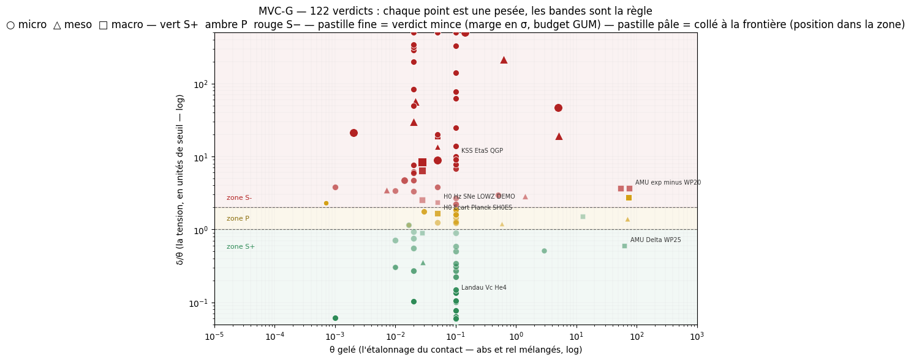
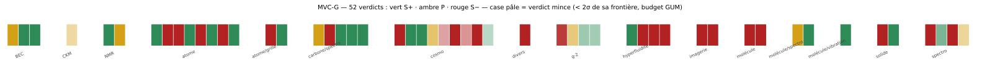

Patrice Portemann
Independent Researcher in Applied Mathematics & Physics

**Dépôt principal : [`mvcg`](https://github.com/PORTEMANN/mvcg)** — opérateur de verdict S+/P/S−.

Manifeste gelé avant mesure, tables vintage, unités rationalisées (HL/Gauss/SI),
tueurs exécutables (I-G1/I-G2), ancre temporelle OpenTimestamps optionnelle.
Quickstart : deux pesées refaites en 10 minutes (Dirac, H₂⁺), le capot
(tare, chaîne typée, calibre) en 5 de plus. Doctrine : capot, balance,
justesse, métrologie quantique. MIT, CI verte, `numpy` seule dépendance.

## La machine en un regard (2026-09-19 — 122 contacts, 18 fibres)

Chaque pastille est un contact pesé : sa **couleur** est le verdict
(**S+** vert : l'écart tient dans θ gelé ; **P** ambre : au cheveu ;
**S−** rouge : l'écart dépasse), sa **position** est le casier
(dimension × espèce — modules de distance, constantes, spectres…).
Cartes dérivées du registre, jamais dessinées à la main : régénération = mêmes octets.

Derniers arcs : le chantier TRANSVERSALE — vingt pesées de la fouille
transversale du corpus (2026-09-16/18) : **6 S+ tenus, 14 S−, 0 P**. Le
corpus y est fiable comme transcripteur de la physique standard, fragile
dès qu'il extrapole — cinq familles de défaillance nommées (dettes
d'écriture, définitions perdues, datation, modèles contre leurs ancres,
tares de frontière). Bilan complet :
[BILAN-TRANSVERSALE](https://github.com/PORTEMANN/mvcg/blob/main/docs/BILAN-TRANSVERSALE.md).
Avant : LOI-HARMONIQUE (Koide 9,2e-5 θ, le plus serré du registre ;
gamme ANU 1908 ; G11 à 20 022 θ) ; E44 (paire de Hopf validée, P3
réfutée) ; PRINCIPES (RG 1-loop / 2-boucles) ; g-2 (WP25/WP20) ; couplet
Lamb ; spectroscopie CO.

La carte d'identité groupe les mêmes pesées par famille — de l'atome au
diagramme de Hubble. L'espace complet (θ × δ/θ, les bandes sont la règle de
verdict) vit dans le
[README de mvcg](https://github.com/PORTEMANN/mvcg#la-carte-des-verdicts).

> Un S+ veut dire : l'écart tient dans la tolérance gelée. Il ne veut pas dire
> que la nature, l'esprit ou l'histoire des idées ont parlé.
> Voir la note de différenciation du dépôt.

---

## Archive

Le corpus historique « Machine noétique » (chantiers P0–P48, séries A/M/E,
registre des frontières) est conservé tel quel dans
[`noetic-machine-complete`](https://github.com/PORTEMANN/noetic-machine-complete)
et ses dépôts satellites. C'est une **archive** : elle n'est ni importée ni
pointée depuis `mvcg`, et ses résultats n'engagent pas le protocole MVC-G.

Discipline commune aux deux : zéro paramètre ajusté, levier discriminant,
échecs publiés (B3-FAIL), empreintes SHA-256.

## Dépôts

| Dépôt | Rôle | Statut |
|---|---|---|
| [`mvcg`](https://github.com/PORTEMANN/mvcg) | Opérateur de verdict à coût gelé (MÉT-LIB-1.5) | **actif — v0.3** |
| [`noetic-machine-complete`](https://github.com/PORTEMANN/noetic-machine-complete) | Archive canonique du corpus historique | gelée |
| `noetic-machine` · `noetic-ash` · `noetic-ash-corpus` · `noetic-applications` · `noetic-mdu` · `spectral-triple-minimality` · `ko6-spectral-solver` · `koilon-scale-e8` | Archives et satellites du corpus historique | gelés |

## Contact

[patrice@portemann.eu](mailto:patrice@portemann.eu) — ORCID 0009-0009-4016-8389
